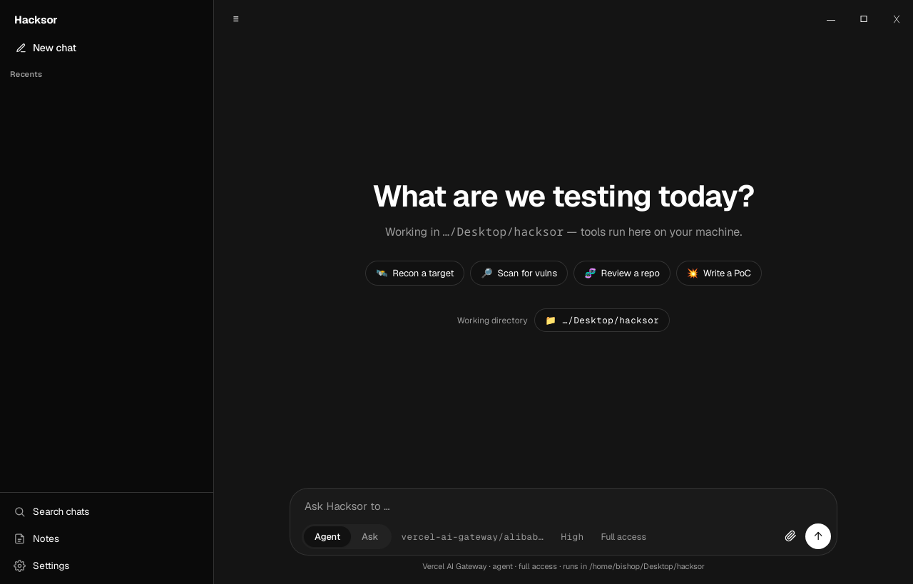

# Hacksor

Hacksor is a local-first AI penetration-testing assistant. It is a single desktop
app (one Tauri client, Rust backend plus web UI) that drives the **Codex agent
harness** on your own machine and gives it a full Kali toolset inside a bundled
Docker runtime. No cloud backend, no account, no telemetry: the only thing that
leaves your machine is the model API call to the provider you choose.

It began as a fork of HackerAI, with all the hosted infrastructure removed
(Convex, Trigger.dev, E2B, WorkOS, Stripe) and replaced by one process you run
locally.

[](https://github.com/louislafosse/hacksor/actions/workflows/ci.yml)
[](https://github.com/louislafosse/hacksor/actions/workflows/release.yml)

<p align="center">
  
</p>

> **Authorized use only.** Hacksor is built for security testing you are
> authorized to perform (your own systems, an explicit engagement scope, a lab,
> or a bug-bounty program). You are responsible for staying in scope and within
> the law.

## Contents

- [What you get](#what-you-get)
- [How it works](#how-it-works)
- [Tech stack](#tech-stack)
- [The two runtime modes](#the-two-runtime-modes)
- [Bundled toolkit](#bundled-toolkit)
- [Install](#install)
- [Build from source](#build-from-source)
- [First run](#first-run)
- [Releases and versioning](#releases-and-versioning)
- [Repository layout](#repository-layout)

## What you get

**Chat and agent loop**
- Ask mode (read-only advice) and Agent mode (executes end to end on your machine).
- Permission modes: full access, ask-approval (dangerous commands pause for you),
  auto-review (a reviewer model judges each gated action), and read-only.
- Streaming markdown with syntax highlighting, Mermaid diagrams, KaTeX math,
  command cards, diffs, plan/todo, and a tool-output drawer.
- Multi-thread history with search across every on-disk chat, pinned chats,
  edit-and-resend, a message queue, and a Recents/Archive view.
- Custom standing instructions and personality presets (cynic, robot, nerd,
  mentor).
- Automatic context compaction from the harness, so long engagements keep going.

**Providers and models**
- Every request routes through a local **OpenCodex** proxy that fronts 40+
  upstream providers. Add an OpenRouter and/or Vercel AI Gateway key and switch
  per chat.
- The model list is fetched live from the provider catalog and is searchable in
  the header. Reasoning effort and vision support are inferred per model, with
  auto-routing to a vision-capable model when you attach an image.

**Full penetration-testing platform** (in the bundled Docker runtime)
- A complete Kali arsenal preinstalled and on PATH: recon, scanning, fuzzing,
  crawling, web-vuln, TLS, DNS, cloud, secrets, SAST, and more (see
  [Bundled toolkit](#bundled-toolkit)).
- Live vulnerability research and CVE-to-PoC workflow (cvemap, NVD, Exploit-DB,
  GitHub PoC indexes, nuclei templates), refreshed each session.
- 60+ methodology skill docs the agent can consult on demand.
- A findings knowledge base and a Markdown report generator.

**Four bundled Hacksor CLIs the agent drives**
- `hacksor-proxy`: a Burp-Suite-style intercepting proxy for the terminal
  (history, repeater, intruder, decoder, comparer, target scope, match-and-replace,
  and a race mode for TOCTOU/limit-bypass testing), built on mitmproxy.
- `hacksor-session`: interactive PTY sessions backed by tmux, so the agent can
  drive tools that need a live console (msfconsole, ssh, netcat shells,
  `sqlmap --sql-shell`, language REPLs, password prompts).
- `hacksor-subagent`: implicit divide-and-conquer workers. For a large job that
  splits into independent parts (many subdomains, hosts, endpoints, or
  parameters), the agent decides on its own to fan the work out across parallel
  Codex workers, then merges the reports.
- `hacksor-findings`: a structured vulnerability knowledge base
  (severity, CVSS, OWASP class, URL, evidence) plus report generation.

**Stealth browser**
- A programmatic anti-detection browser (Camoufox, a stealth build of Firefox)
  exposed to the agent as first-class tools through the camofox MCP server. It
  gets through anti-bot walls (Cloudflare, Turnstile, Datadome) that block plain
  Chromium, and its clicks and typing are humanized, so logins and registrations
  look like a real person. Profiles and cookies persist so sessions stay logged
  in.

**Local and private**
- Threads, rollouts, notes, settings, and your API keys live under the app data
  dir. Nothing is sent anywhere except the model API calls.

## How it works

```
Desktop app (Tauri)
  Web UI (Vite + TypeScript)              Rust backend (src-tauri)
        |  Tauri IPC commands   <------>  owns the session, settings, runtime
        ^  event stream                        |
        |                                       v
        |                          spawns `codex app-server`  (JSON-RPC over stdio)
        |                                       |
        |                                       v
        |                          OpenCodex proxy (ocx)  127.0.0.1:10100
        |                                       |
        |                          routes by model-id prefix
        |                                       v
        |                    OpenRouter / Vercel AI Gateway / Anthropic / ...
```

The Rust backend spawns the `codex app-server` and speaks newline-delimited
JSON-RPC to it over stdio. Codex owns the deterministic agent loop: the shell
tool (real local exec with read-only / workspace-write / full-access sandbox
policies), `apply_patch`, plan and todo, web search, approvals, and context
compaction. Hacksor layers the security persona and methodology on top as Codex
developer instructions, so the tool contract stays intact.

Every model request goes through the local OpenCodex proxy on `127.0.0.1:10100`.
OpenCodex serves one merged catalog where each model id is prefixed by its
upstream (`openrouter/...`, `vercel-ai-gateway/...`, `anthropic/...`), and the
proxy picks the upstream from that prefix. The OpenRouter and Vercel choices in
the UI are filtered views over that catalog, so switching provider needs no
translation shim.

## Tech stack

| Layer | Technology | Role |
|---|---|---|
| Desktop shell | **Tauri 2** (Rust + WebView) | Native window, IPC, packaging, small binary |
| Frontend | **Vite + TypeScript** (vanilla) | Streaming chat UI, markdown, diagrams, approvals |
| Backend | **Rust** (tokio) | Session, settings, runtime orchestration, harness client |
| Agent loop | **Codex** (`codex app-server`) | Shell, apply_patch, plan, approvals, compaction over JSON-RPC |
| Provider routing | **OpenCodex** (`ocx`) | Local proxy fronting 40+ providers, prefix-based upstream selection |
| Runtime container | **Docker** + **bollard** | Bundled Kali image, Engine API from Rust |
| Base image | **Kali Rolling** | Full security toolchain, Go and Python tools |
| Intercepting proxy | **mitmproxy** (`hacksor-proxy`) | Terminal Burp: history, repeater, intruder, scope, match-replace, race |
| Stealth browser | **Camoufox** + **camofox-mcp** | Anti-bot Firefox as MCP tools, humanized input |
| Interactive consoles | **tmux** (`hacksor-session`) | Persistent PTY sessions for msfconsole, ssh, REPLs |
| Parallel workers | **`codex exec`** (`hacksor-subagent`) | Implicit fan-out for large, splittable jobs |

## The two runtime modes

Set the runtime in Settings.

**Host mode.** The agent's tools run directly on your machine using your locally
installed `codex` CLI and whatever tools you have. Good if you already run a
security-tooling host and want zero containers.

**Docker mode (recommended).** Hacksor builds and runs a `hacksor-runtime`
container from the bundled `docker/Dockerfile` (Kali plus the full arsenal, the
OpenCodex proxy, the intercepting proxy, the stealth browser, and the four
Hacksor CLIs). The `codex app-server` runs inside the container via
`docker exec`, so every tool call executes in the container, not on your host.
On Linux the container uses host networking; on macOS and Windows (Docker
Desktop) the required ports are published to loopback. The image is built locally
for your host architecture, so it is native on Apple Silicon, Intel, and Linux.

Heavy services (the stealth browser and the intercepting proxy) are
lazy-started on first use by default to keep RAM low; a Settings toggle switches
them to always-on.

## Bundled toolkit

The Docker runtime ships these on PATH (non-exhaustive):

- **Recon / DNS:** subfinder, amass, assetfinder, dnsx, tlsx, asnmap, mapcidr,
  uncover, `cloudfish` (Cloudflare DNS-scanner subdomains, needs CF creds).
- **Scanning:** nmap, naabu, masscan.
- **Web probe / crawl / fuzz:** httpx-toolkit, katana, hakrawler, gau,
  waybackurls, gobuster, feroxbuster, ffuf, arjun, gowitness, whatweb, wafw00f.
- **Web vuln:** nuclei (templates pre-fetched), dalfox (XSS), sqlmap (SQLi),
  sstimap (SSTI), nikto, testssl.
- **SAST / secrets:** semgrep, trufflehog, gitleaks.
- **Auth / crypto / API:** jwt_tool, phpggc and ysoserial (deserialization gadget
  chains), kiterunner (API routes), hydra, john, hashid.
- **Cloud:** cloudfox and scoutsuite (need the target's cloud credentials).
- **CVE intel / exploits:** cvemap, searchsploit, gh (GitHub CLI).
- **OOB / utility:** interactsh-client, socat, netcat, tcpdump, openssl, binwalk,
  exiftool, ripgrep, SecLists and wordlists under `/usr/share`.
- **Hacksor CLIs:** hacksor-proxy, hacksor-findings, hacksor-session,
  hacksor-subagent.

## Install

Grab the installer for your platform from the
[Releases](https://github.com/louislafosse/hacksor/releases) page. Hacksor ships
as a proper installer per platform, not a bare binary, so the app registers and
launches the way a desktop app should:

| Platform | Artifact |
|---|---|
| macOS (Apple Silicon and Intel) | `.dmg` |
| Windows | `.msi` and `.exe` (NSIS setup) |
| Linux | `.deb`, `.rpm`, and `.AppImage` |

Unsigned builds trigger a first-run warning (macOS Gatekeeper, Windows
SmartScreen). On macOS, right-click the app and choose Open the first time; on
Windows, choose More info then Run anyway. Signed builds are produced when the
signing secrets are configured (see [Releases and versioning](#releases-and-versioning)).

**Runtime prerequisites**
- **Docker** (Docker Desktop on macOS and Windows, Docker Engine on Linux) for
  the recommended Docker runtime. On first use Hacksor builds the Kali image for
  your architecture; this takes a while and needs disk space, then is cached.
- The **`codex` CLI** on your PATH for host mode (Docker mode ships it inside the
  container). Install from https://github.com/openai/codex.
- An **OpenRouter** and/or **Vercel AI Gateway** API key.

## Build from source

Prerequisites: Rust (stable), Node 20 or newer, pnpm, and Docker (for the
runtime). On Linux also install the Tauri system libraries
(`libwebkit2gtk-4.1`, `libgtk-3`, and the appindicator/rsvg dev packages).

```bash
git clone https://github.com/louislafosse/hacksor.git
cd hacksor
pnpm install
pnpm tauri dev        # run in dev

pnpm tauri build      # produce installers for the current platform
```

## First run

1. Open **Settings**, paste your OpenRouter (and/or Vercel AI Gateway) key.
2. Choose a working directory: where the agent's tools run and where output
   lands.
3. Pick the runtime (Docker recommended) and, in Docker mode, build the runtime
   image when prompted.
4. Pick a model and a mode (Agent or Ask) and a permission mode, then start a
   chat.

Optional: add Cloudflare credentials in Settings to enable `cloudfish` as an
extra subdomain source.

## Releases and versioning

Releases are fully automated and driven by
[Conventional Commits](https://www.conventionalcommits.org).

- **Versioning:** on every push to `main`, `semantic-release` reads the commit
  history, decides the next version, and writes it into `package.json`,
  `src-tauri/tauri.conf.json`, `src-tauri/Cargo.toml`, and `Cargo.lock` (via
  `scripts/set-version.py`). It updates `CHANGELOG.md`, commits, tags `vX.Y.Z`,
  and creates the GitHub Release with generated notes. Use commit prefixes like
  `feat:` (minor), `fix:` (patch), and `feat!:` or a `BREAKING CHANGE:` footer
  (major).
- **Builds:** the release workflow then builds installers on a matrix of macOS
  (Apple Silicon and Intel), Windows, and Linux with `tauri-action`, and uploads
  them to that release.
- **CI:** pull requests and non-main pushes run `ci.yml` (frontend build, Rust
  build and tests).
- **Runtime image:** `runtime-image.yml` validates that the Kali image still
  builds from scratch and every core tool installs.

Workflows live in `.github/workflows/`. Code signing is optional and off by
default; set the Apple secrets (`APPLE_CERTIFICATE`, `APPLE_CERTIFICATE_PASSWORD`,
`APPLE_SIGNING_IDENTITY`, `APPLE_ID`, `APPLE_PASSWORD`, `APPLE_TEAM_ID`) and a
Windows signing setup to produce signed, notarized builds.

## Repository layout

| Path | Purpose |
|---|---|
| `src/` | Vite + TypeScript chat UI |
| `src-tauri/src/harness.rs` | Spawns and drives `codex app-server` over JSON-RPC |
| `src-tauri/src/commands.rs` | Tauri command surface (chat, settings, runtime, services) |
| `src-tauri/src/runtime.rs` | Docker runtime lifecycle via bollard |
| `src-tauri/src/models.rs` | Providers and the OpenCodex-fronted model catalog |
| `src-tauri/src/settings.rs` | Local settings and secrets |
| `prompts/hacksor-developer.md` | Security persona, authorization policy, methodology |
| `skills/` | Methodology skill docs bundled into the binary |
| `docker/Dockerfile` | The bundled Kali runtime image |
| `docker/hacksor-*` | The bundled CLIs (proxy, findings, session, subagent) and cloudfish |
| `.github/workflows/` | CI, release, and runtime-image pipelines |
| `ROADMAP.md` | Detailed changelog and roadmap |

## Credits

Hacksor is a local-first fork of [HackerAI](https://github.com/hackerai-tech/hackerai).
It builds on [Tauri](https://tauri.app), [Codex](https://github.com/openai/codex),
OpenCodex, [mitmproxy](https://mitmproxy.org),
[Camoufox](https://github.com/daijro/camoufox), and the Kali toolchain.
